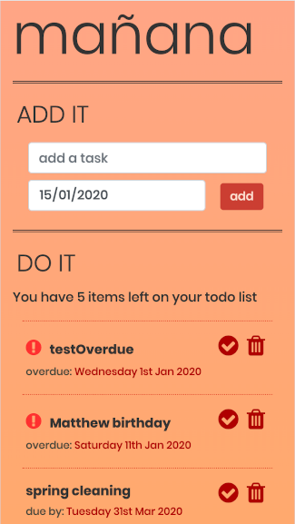

# Todo Application - Frontend

This is the front end of a Todo Application, built throughout the [Tech Returners](https://techreturners.com) Your Journey Into Tech course. It integrates with a backend, available [here](https://github.com/GitOffMyCode/manana-backend).

The hosted version of the application is available here: [https://gitoffmycode.github.io/manana-react/](https://gitoffmycode.github.io/manana-react/)

### Technology Used

This project uses the following technology:

- ReactJS
- JavaScript (ES2015+)
- CSS
- Axios
- MomentJS

It has been designed and built with mobile-first reponsive principles in mind.

#### Image of the App on GalaxyS5

### Running the application locally

[Node.js](https://nodejs.org/en/) must be installed if not already.

Clone the application and install dependencies:

    npm install

To start the application:

    npm start

The application will then be accessible at:

[http://localhost:3000](http://localhost:3000)